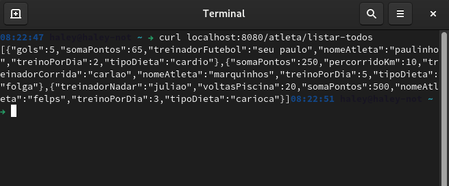
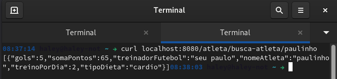
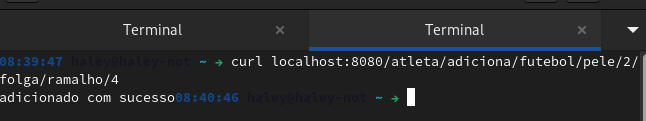
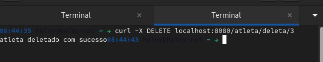

# Avaliacao Continuada

 > Nessa avaliacao foram necessarios implementar as classes abstratas e interface para seguir as regras dada pelo enumciado do exercicio, onde os metodos implementado dentro da classe interface são abstratas por si só, não necesariamente usar 'abstract' no metodo.

## Rotas

* Listar todos os atletas

` $ curl localhost:8080/atleta/listar-todos `

  
  
  
* Busca o atleta

` $ curl localhost:8080/atleta/busca-atleta/{atleta} `

  
  
  
* Adiciona atleta

` $ curl localhost:8080/atleta/adiciona/{atleta}/{nome}/{treino}/{dieta}/{treinador}/{pontos} `

  
  

* Deleta atleta

` $ curl localhost:8080/atleta/deleta/{atleta} `

  
